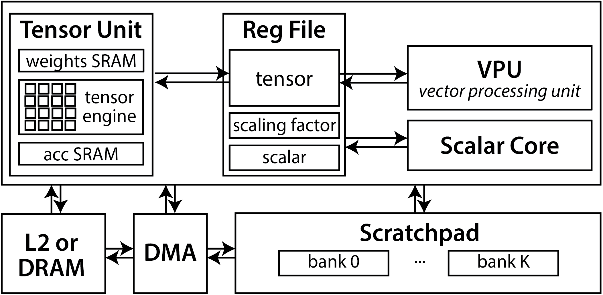

# Atlas NPU



Using Atlas
-------------

This repository cannot be used stand-alone.
Atlas-NPU is intended to be used to generate an accelerator tile that is attached to a RISC-V system through the [Chipyard](https://github.com/ucb-bar/chipyard) SoC design framework.

## Getting Started

Mill is already included at the root of this repository.

To test if mill is installed successfully, run the following command:  

```bash
./mill --version
```

It should print out something like the following:

```bash
Mill Build Tool version 0.13.0-M0
Java version: 11.0.30, vendor: Ubuntu, runtime: /usr/lib/jvm/java-11-openjdk-amd64
Default locale: en_US, platform encoding: UTF-8
OS name: "Linux", version: 6.8.0-87-generic, arch: amd64
```

Generating Verilog file:

```bash
make verilog
```

Running test:

```bash
cd baremetal
make test-all
```
